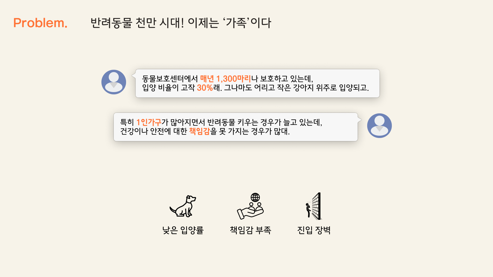

# 쓰담 - 유기동물 매칭 플랫폼

💻 유기견 입양을 원하는 사람들과 보호소를 연결해주는 매칭 플랫폼

## **🔎 기획 의도**

1️⃣ **낮은 입양률** : 동물보호센터에서 1년에 약 1,300마리의 반려동물을 보호하지만 입양 비율은 30%가량 뿐이며, 그마저도 어리고 작은 강아지 위주로 입양됨

**2️⃣ 책임감 부족** : 1인 가구의 증가에 따른 반려동물이 증가하고 있지만, 그에 따른 건강과 안전을 위한 책임감을 충분히 갖지 못하는 경우가 많음. 이로 인해 동물이 버려지거나 방치되는 일이 발생

**3️⃣ 진입장벽** : 입양을 위해 상세한 서류 작성, 소득 증빙, 양육 환경 검증 등 복잡한 과정을 거쳐야 하는 경우가 많아 큰 걸림돌이 됨

 

## 💻 기술 스택

    
    
    
    
    
    
    
    
    
    
    
    
    
    
    
    
    
    

    
    
    
    
    
    

    
    
    
    
    
    

  

## 💡주요 기능

